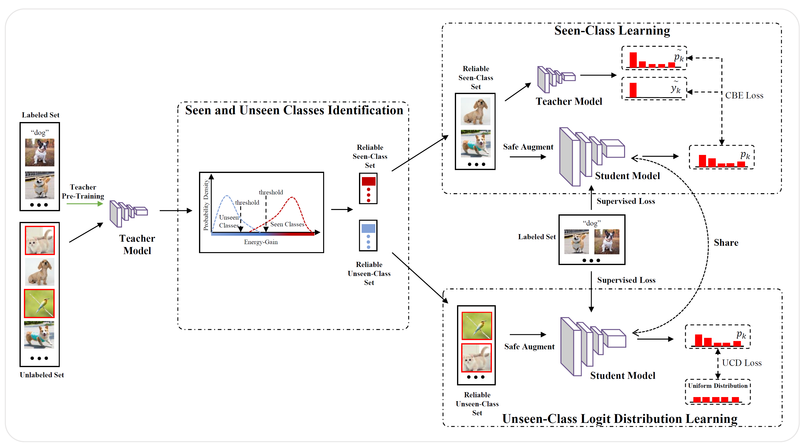

# Safe-Student
[CVPR 2022]Safe-Student for Safe Deep Semi-Supervised Learning with Unseen-Class Unlabeled Data

## Introduction
This is the code for paper(CVPR2022) "Safe-Student for Safe Deep Semi-Supervised Learning with Unseen-Class Unlabeled Data".

## Setups
The codebase is implemented using Python and PyTorch. 

To replicate our environment and ensure seamless execution of the code, we recommend rebuilding the environment using the provided `environment.yaml` file. This can be done using the following Conda command:
```bash
conda env create -f environment.yaml
```


## Fremawork
For a quick overview of the SAFE-STUDENT framework, refer to the framework diagram included in this repository:



## Running SAFE-STUDENT for benchmark dataset

Here is an example.

Step 1: Teacher Pretraining
```bash
python teacher_pretrain.py --model WideResnet --dataset CIFAR10 --n_labels 2400 --n_unlabels 20000 --n_valid 5000 --n_class 6 --ratio 0.6
```

Step 2: Safe Student Training and Testing
```bash
python safe_student_CIFAR10.py --model WideResnet --tau_1 0.6 --tau_2 0.5 --dataset CIFAR10 --n_labels 2400 --n_unlabels 20000 --n_valid 5000 --n_class 6 --ratio 0.6 --name CIFAR10_06 --ts_iteration 3
```
